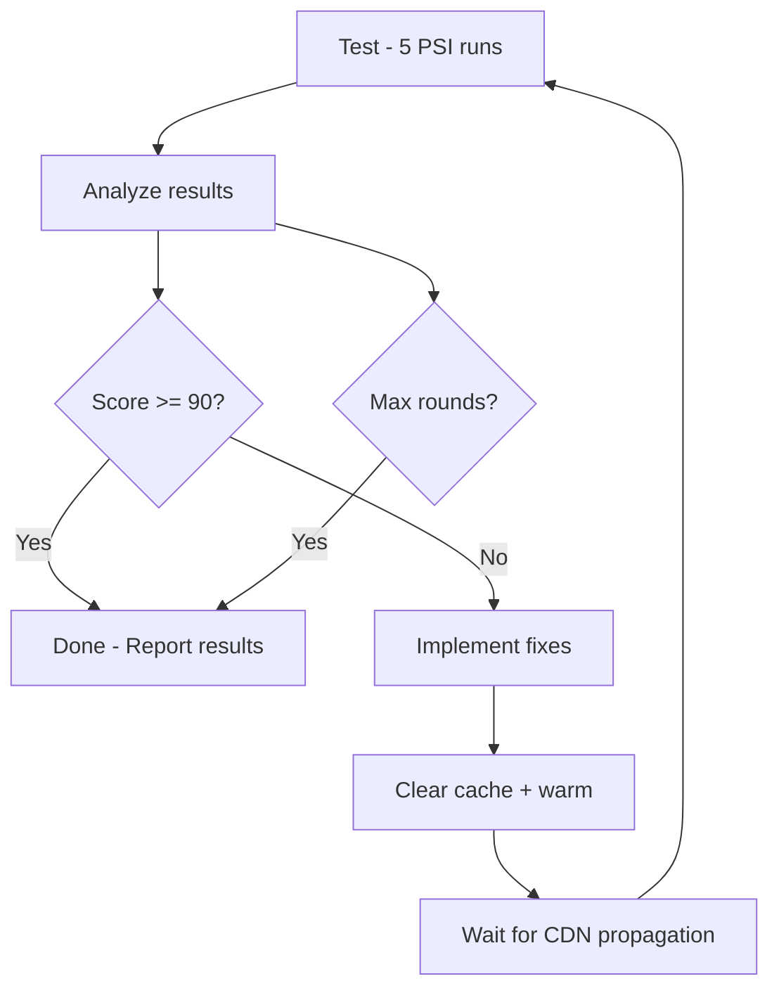

# Site Optimization

The Site Optimization service provides autonomous and advisory performance optimization targeting 90+ mobile Lighthouse scores.

## Commands

### Autonomous (Auto-Fix)

| Command | Target |
|---------|--------|
| `/pagespeed {url}` | Performance score optimization |
| `/accessibility {url}` | Accessibility compliance |
| `/bestpractices {url}` | Best practices compliance |

### Advisory (Recommend Only)

| Command | Target |
|---------|--------|
| `/pagespeed-recommend {url}` | Performance recommendations without implementation |
| `/accessibility-recommend {url}` | Accessibility audit report |
| `/bestpractices-recommend {url}` | Best practices audit report |

## How Autonomous Optimization Works

The autonomous commands run a loop:



- **PageSpeed**: Max 5 rounds, exits on 90+ average
- **Accessibility**: Max 3 rounds
- **Best Practices**: Max 3 rounds

## Performance Targets

| Metric | Target | Description |
|--------|--------|-------------|
| FCP | < 1800ms | First Contentful Paint |
| LCP | < 2500ms | Largest Contentful Paint |
| TBT | < 200ms | Total Blocking Time |
| CLS | < 0.1 | Cumulative Layout Shift |
| SI | < 3400ms | Speed Index |

## Common Fix Priority

1. LCP image preloading
2. DOM size reduction
3. JavaScript delay/deferral
4. CSS optimization
5. Font loading
6. Image optimization (AVIF, srcset)
7. Third-party script management

## Scripts Used

| Script | Purpose |
|--------|---------|
| `pagespeed.sh` | PSI API multi-run testing |
| `accessibility.sh` | Accessibility audit via PSI |
| `bestpractices.sh` | Best practices audit via PSI |
| `validate.sh` | Live page validation (DOM, console, images, network) |
| `clear-cache.sh` | Perfmatters + Kinsta cache clearing |

## Proven Results

| Site | Before | After |
|------|--------|-------|
| Bird Control Australia | 29 | 90+ |
| CannaClear | 86 | 92 |
| Dancewear UK | 60 | 96 |

Site-specific case studies will be added as sites are migrated to the Blaze Dev Kit.

## File Mapping

```
.claude/
├── commands/
│   ├── pagespeed.md                    # Autonomous PageSpeed optimization
│   ├── pagespeed-recommend.md          # Advisory PageSpeed audit
│   ├── accessibility.md               # Autonomous accessibility optimization
│   ├── accessibility-recommend.md      # Advisory accessibility audit
│   ├── bestpractices.md               # Autonomous best practices optimization
│   └── bestpractices-recommend.md      # Advisory best practices audit
│
├── skills/
│   ├── wp-performance/SKILL.md         # Core Web Vitals diagnostics
│   └── database-administrator/SKILL.md # MySQL/query optimization
│
├── agents/
│   └── wp-performance-optimizer.md     # 90+ Lighthouse implementation
│
├── scripts/
│   ├── pagespeed.sh                    # PSI API multi-run testing
│   ├── accessibility.sh               # Accessibility audit via PSI
│   ├── bestpractices.sh               # Best practices audit via PSI
│   ├── validate.sh                    # Live page validation (DOM, console, images)
│   └── clear-cache.sh                 # Perfmatters + Kinsta cache clearing
│
└── templates/
    └── CLAUDE-BASE-PERFORMANCE.md      # Performance service base template
```
