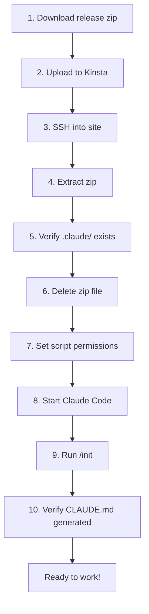

# Developer Setup Workflow

Complete workflow for deploying the Blaze Dev Kit to a new Kinsta-hosted WordPress site.

## Prerequisites

- [ ] Claude Code installed on your machine
- [ ] SSH access to the Kinsta site
- [ ] SFTP client or terminal access
- [ ] PageSpeed API key (for optimization commands)

## Workflow



## Step-by-Step

### 1. Download the Release

Go to [github.com/blaze-commerce/blaze-dev-kit/releases](https://github.com/blaze-commerce/blaze-dev-kit/releases) and download the latest `.zip` file.

!!! warning "Do NOT clone the repo"
    The repository contains docs, QA tests, and CI files that should NOT be on your site. Always use the release zip.

### 2. Upload to Kinsta

```bash
scp blaze-dev-kit-v0.1.0.zip user@site.kinsta.cloud:~/public/
```

### 3. SSH and Extract

```bash
ssh user@site.kinsta.cloud
cd ~/public
unzip blaze-dev-kit-v0.1.0.zip
```

### 4. Verify and Clean Up

```bash
# Verify extraction
ls -la .claude/
cat .claude/../VERSION 2>/dev/null || cat .claude/settings.json | head -1

# Delete the zip (MANDATORY)
rm blaze-dev-kit-v0.1.0.zip

# Set executable permissions on scripts
chmod +x .claude/scripts/*.sh
```

### 5. Initialize Claude Code

```bash
# Start Claude Code in the site directory
claude

# Run initialization
/init
```

### 6. Verify Initialization

After `/init` completes, verify:

- [ ] `CLAUDE.md` exists in site root
- [ ] `CHANGELOG.md` exists in site root
- [ ] `CLAUDE.md` contains your site name and URL
- [ ] `CLAUDE.md` lists your active theme and plugins

### 7. Test a Command

```bash
# Quick test - check version
/version-check

# Or run a PageSpeed test
/pagespeed https://your-site.com
```

## Troubleshooting

### "Command not found" when running /init

Ensure you're running Claude Code from the site root directory where `.claude/` is located.

### Scripts not executable

```bash
chmod +x .claude/scripts/*.sh
```

### WP-CLI not available

WP-CLI is pre-installed on all Kinsta sites. If it's not working, check your SSH connection is to the correct environment (staging vs production).
